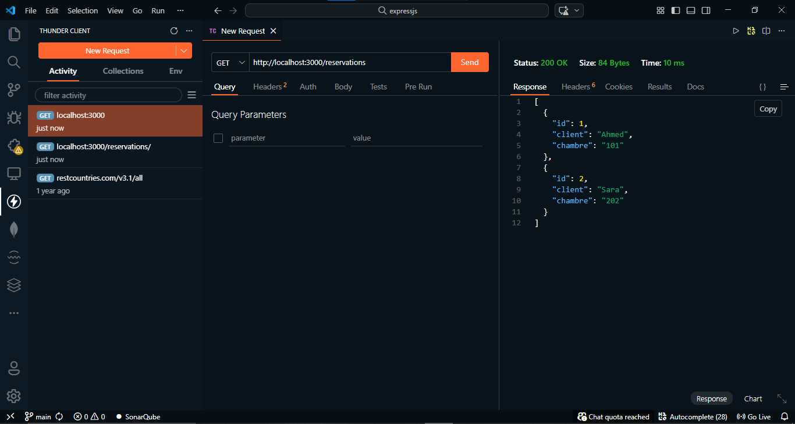

# <p align="center"><a href="https://git.io/typing-svg"></a></p>

## 🚀 À propos du projet

Ce projet est une API back-end simple pour la gestion des réservations, développée avec **Node.js** et **Express.js**. Elle expose des opérations CRUD (Créer, Lire, Mettre à jour, Supprimer) permettant de gérer les réservations de chambres de manière efficace.

## 🛠️ Stack Technique

<p align="center">
  <a href="https://nodejs.org" target="_blank" rel="noreferrer">
    
  </a>
  &nbsp;&nbsp;&nbsp;&nbsp;
  <a href="https://expressjs.com" target="_blank" rel="noreferrer">
    <!-- Express icon with inverted coloration for visibility in dark/light modes -->
    
  </a>
  &nbsp;&nbsp;&nbsp;&nbsp;
  <a href="https://developer.mozilla.org/en-US/docs/Web/JavaScript" target="_blank" rel="noreferrer">
    
  </a>
  &nbsp;&nbsp;&nbsp;&nbsp;
  <a href="https://www.postman.com/" target="_blank" rel="noreferrer">
    
  </a>
  &nbsp;&nbsp;&nbsp;&nbsp;
  <a href="https://www.thunderclient.com/" target="_blank" rel="noreferrer">
    
  </a>
</p>

## ⚙️ Installation & Démarrage

1. **Cloner ou télécharger le dépôt** de l'API.
2. **Naviguer dans le dossier du projet** :
   ```bash
   cd expressjs
   ```

3. **Installer les dépendances** :
   ```bash
   npm install
   ```

4. **Démarrer le serveur** :
   ```bash
   node app.js
   ```
   Le serveur sera lancé sur `http://localhost:3000`.

## 🏗️ Architecture du Projet (MVC)

Ce projet respecte désormais l'architecture **Modèle-Vue-Contrôleur (MVC)** pour une meilleure séparation des responsabilités et une maintenance simplifiée :
- 📁 **`models/`** : Gère l'accès aux données (simulées actuellement via un tableau en mémoire).
- 📁 **`controllers/`** : Traite la logique métier, manipule les modèles et renvoie les réponses HTTP adaptées.
- 📁 **`routes/`** : Définit l'ensemble des points d'entrée de l'API (endpoints) et les achemine vers les bons contrôleurs.
- 📁 **`middlewares/`** : Intercepte les requêtes entrantes (ex: `logger.middleware.js` pour journaliser toutes les requêtes dans la console).

## 📌 Points d'accès de l'API (Endpoints)

L'API expose le groupe principal `/reservations` :

| Méthode | Route | Description |
| :--- | :--- | :--- |
| `GET` | `/` | Point d'entrée de l'API (Message d'accueil express) |
| `GET` | `/reservations` | Récupère la liste de toutes les réservations |
| `GET` | `/reservations?client=Nom` | Recherche des réservations filtrées par le nom du client |
| `GET` | `/reservations/:id` | Récupère les détails complets d'une réservation selon son identifiant unique |
| `POST` | `/reservations` | Crée une réservation (Format attendu en Body JSON: `{ "client": "...", "chambre": "..." }`) |
| `PUT` | `/reservations/:id` | Mets à jour les informations d'une réservation existante |
| `DELETE` | `/reservations/:id` | Supprime définitivement une réservation par son identifiant |
| `GET` | `/info` | Affiche vos informations client comme le `User-Agent` récupéré depuis les Headers HTTP |

### 💡 Exemples d'utilisation (CLI)

**1. Récupérer l'ensemble des données**
```bash
curl -X GET http://localhost:3000/reservations
```

**2. Ajouter une nouvelle réservation test**
```bash
curl -X POST http://localhost:3000/reservations \
  -H "Content-Type: application/json" \
  -d '{"client": "Jean Dupont", "chambre": "305"}'
```

## 📸 Galerie

<!-- Ajoutez vos captures d'écran ici, par exemple des requêtes Postman -->
<p align="center">
  
</p>

---
